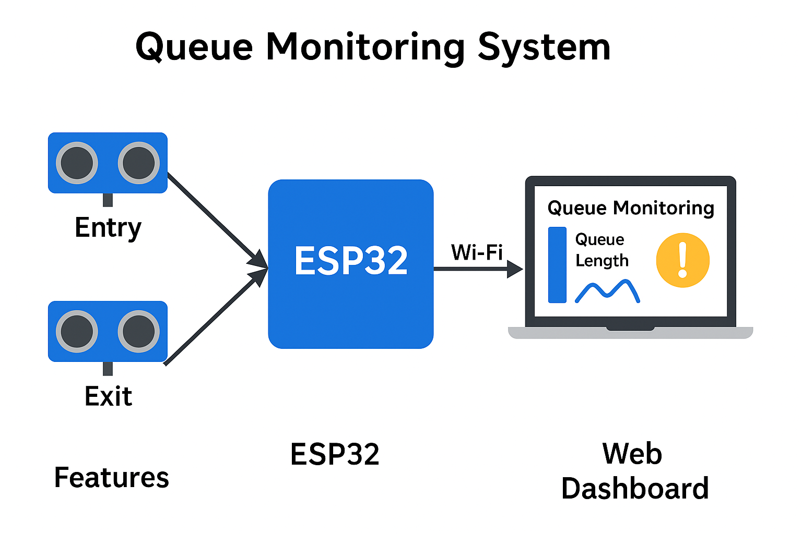

# Real Time Queue Length Estimation using Wireless Sensor Nodes

A modular ESP32-based system to monitor and visualize queue length using ultrasonic sensors.

---

## Project Overview

This Smart Queue Monitor system uses two HC-SR04 ultrasonic sensors to detect people entering and exiting a queue area.  
It tracks current queue length, total entries and exits, and provides a real-time web dashboard for visualization.

---

## Features

- Real-time queue monitoring using ultrasonic sensors  
- Responsive web dashboard with charts and status indicators  
- Automatic alerts (visual and audible) when queue exceeds threshold  
- WiFi connectivity with mDNS support for easy access via hostname  
- Remote access via ngrok tunneling  
- Modern UI with responsive design

---

## Hardware Requirements

- ESP32 Development Board  
- 2× HC-SR04 Ultrasonic Distance Sensors  
- Buzzer (for audio alerts)  
- Breadboard & jumper wires  
- Power supply for ESP32

---

## Pin Configuration

| Component               | ESP32 Pin |
|:-------------------------|:---------:|
| Entry Sensor Trigger     | GPIO5     |
| Entry Sensor Echo        | GPIO18    |
| Exit Sensor Trigger      | GPIO19    |
| Exit Sensor Echo         | GPIO21    |
| Buzzer                   | GPIO27    |

---

## System Architecture

The code is organized into modular components:

- `network_config.h` — WiFi and mDNS connection management  
- `ultrasonic_sensor.h` — Sensor initialization and distance measurement  
- `web_server.h` — Web server and dashboard (HTML/JS/CSS)  
- `buzzer_controller.h` — Buzzer control for alerts  
- `queue_monitor.h` — Queue state tracking logic  
- `smart_queue_monitor.ino` — Main program integrating all components

---

## Setup Instructions

### 1. Install Required Libraries

- Install **ESP32 board support** via Arduino IDE Boards Manager  
- Install libraries:  
  - `WebServer`  
  - `ESPmDNS`  
  - `ArduinoJson`

### 2. Hardware Connections

Wire up the ultrasonic sensors and buzzer as per the above **Pin Configuration** table.

### 3. Flashing the ESP32

- Open the `smart_queue_monitor.ino` sketch.  
- Modify `network_config.h` to add your WiFi SSID and password.  
- Compile and upload the code to your ESP32 board.  
- Monitor the Serial Output for status updates.

### 4. Accessing the Web Dashboard

- Once connected to WiFi, the ESP32 will advertise itself using mDNS.  
- Access the dashboard via:  
[http://queuemonitor.local/](http://queuemonitor.local/)

(Or use the IP address shown in Serial Monitor.)

---

## Remote Access Using Ngrok

You can make your Smart Queue Monitor dashboard accessible remotely using **ngrok**.

### Steps:

1\. [Download ngrok](https://ngrok.com/download) and install it.\
2\. Authenticate ngrok with your account using:

ngrok authtoken <your_auth_token>

3\. Start an HTTP tunnel for your ESP32's local IP address and port 80:

ngrok http 192.168.x.x:80

4\. Ngrok will provide a public URL (like `https://abc123.ngrok.io`) to access your dashboard from anywhere!

**Tip:** You can automate this by hosting ngrok on a nearby Raspberry Pi or your PC.

---

## System Block Diagram

Here's a simple representation of the architecture:

---

## Future Improvements

- Add authentication to dashboard access.
- Integrate cloud-based analytics.
- Expand system to monitor multiple queues.

---

## Acknowledgements

Special thanks to [Vedanta S P](https://github.com/unworld11) for providing UI and providing backend support for the project.

## Licensing

This project is licensed under the MIT License.
You are free to use, modify, and distribute this project, provided that the original author is credited.

---
